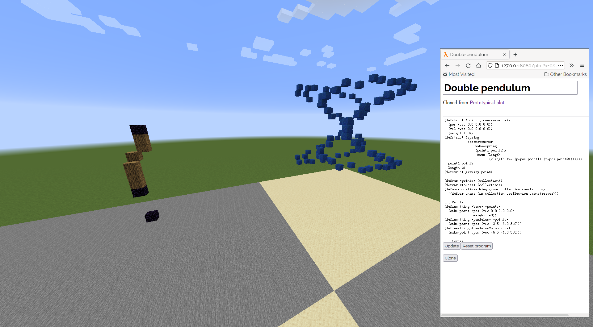

# Some weird sort of "direct manipulation" hack

(minus the direct manipulation tbh)

This was a project I did for the end-of-year university hackathon. The
idea was to provide a way to collaborate on work, without being stuck
into "breakout groups", as they tend to collectively get stuck,
requiring someone to get a teacher or discuss with another group. The
use of a Minecraft server also conveniently introduces a physical
metaphor to reduce the feeling of isolation in class.

This repository is total ~~shit~~prototype quality: it will probably
explode if you look at it funny, and no sandboxing is done in user
code, so you might as well consider yourself already pwned if you
expose to anyone you don't trust.

You might want to just watch [this demo
video](https://www.youtube.com/watch?v=9TQTMvoPJJY) instead of trying
to run this program yourself.

## Getting started

Start a Minecraft server with the
  [RaspberryJuice](https://github.com/zhuowei/RaspberryJuice) plugin,
  running on a superflat world with absolute coordinates (unless you
  want to modify the code to fix that).
  
Then run `(ql:quickload :direct-manipulation-hack)` and navigate to
around -0, 5, -0 in the map. You should see two plots, one with a
three dimensional Lissajous figure, and one with a double pendulum.

http://localhost:8080/ has the "interface" for this project, where you
can look at a list of projects, and clone and edit them.
